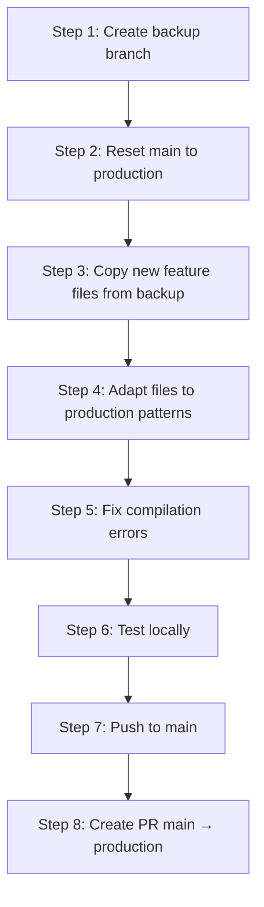

# wezu_admin: Main ↔ Production Deep Analysis & Merge Plan

## Executive Summary

| Metric | Value |
|--------|-------|
| **Total files changed** | 243 |
| **Lines added (production vs main)** | +18,827 |
| **Lines removed (production vs main)** | −38,300 |
| **Commits only on main** | 21 (team merges: Sireesha, Fayaz, Rama, CMS, Audit) |
| **Commits only on production** | 36 (deployed fixes: auth, build, sidebar, API, performance) |
| **Files only in main** | 63 (new modules from teammates) |
| **Files only in production** | 26 (deployed infrastructure) |
| **Files modified in both** | 154 (potential conflicts) |
| **Merge base** | `5f29103` (common ancestor) |

> [!WARNING]
> The two branches have **significantly diverged** (56 commits apart). A naive merge will produce hundreds of conflicts. The recommended approach is to **rebase main onto production**.

---

## Branch History Analysis

### Production Branch (deployed, 36 commits ahead)
The production branch has been hardened for deployment with critical fixes:

| Category | Commits | What changed |
|----------|---------|-------------|
| **Auth hardening** | 8 | Session expired modal, cancel-all on 401, JWT client-side check, browser autofill, password manager DOM reading |
| **Build/Deploy** | 7 | Docker multi-stage optimized, nginx reverse proxy, OOM prevention, shimmer→flutter_animate, deprecated flag removal |
| **API client** | 5 | Error formatting interceptor, retry interceptor, API cache, cursor pagination, timeout configuration |
| **Sidebar/Navigation** | 2 | GoRouter-native navigation, dynamic RBAC menus, collapsible sidebar |
| **Performance** | 3 | Frontend optimizations preventing backend OOM, optimistic UI, skeleton loaders |
| **Bug fixes** | 11 | Infinite provider loops, CORS, user actions wiring, content padding |

### Main Branch (local development, 21 commits ahead)
Main has new feature modules from team contributions:

| Category | Commits | What changed |
|----------|---------|-------------|
| **CMS module** | 4 (Rama) | Complete CMS with cross-platform media uploads, banners, blogs, FAQs, legal docs |
| **Audit & Security** | 4 (Sireesha) | Audit logs, forensics, security events, fraud dashboard |
| **KYC & Analytics** | 2 | KYC management, user analytics with Riverpod |
| **Compilation fixes** | 6 | Resolving merge conflicts, fixing 14+ files, type mismatches |
| **Misc merges** | 5 | Integrating teammates' branches |

---

## Module-by-Module Comparison

### 🔴 Critical: Use Production Version (production is better)

#### 1. API Client (`lib/core/api/api_client.dart`)
- **Production**: 732-line rewrite with retry interceptor, error formatting, API cache, session expired handling, autofill helpers. Removes `flutter_dotenv` dependency (uses `--dart-define` instead)
- **Main**: Original 569-line version using `.env` file with `flutter_dotenv`
- **Verdict**: ✅ **Use production** — it's battle-tested in deployment

#### 2. Auth System (`lib/features/auth/`)
- **Production**: Login page with browser autofill detection, Google Password Manager DOM reading, session expired overlay, client-side JWT expiry check
- **Main**: Simpler login with session_provider (unused in production), user_session model (removed)
- **Verdict**: ✅ **Use production** — critical security fixes

#### 3. Sidebar/Navigation (`lib/core/widgets/admin_layout.dart`, `lib/router/app_router.dart`)
- **Production**: GoRouter-native navigation, dynamic RBAC menus, collapsible sidebar, menu_config.dart
- **Main**: Older layout structure
- **Verdict**: ✅ **Use production** — better architecture

#### 4. Build/Deploy (`Dockerfile`, `nginx.conf`, `docker-compose.*`)
- **Production**: Optimized multi-stage Docker build, BuildKit caching, dart2js OOM prevention, nginx reverse proxy for API
- **Main**: Simple Dockerfile without optimizations
- **Verdict**: ✅ **Use production** — essential for deployment

#### 5. pubspec.yaml
- **Production**: Removed `flutter_dotenv`, `html_editor_enhanced`, `flutter_quill`, `flutter_colorpicker`. Updated `csv` to `^8.0.0`
- **Main**: Still has old packages
- **Verdict**: ✅ **Use production** — cleaner deps

---

### 🟡 Merge Needed: Main has new features to bring into production

#### 6. CMS Module (`lib/features/cms/`)
- **Production**: Has `banner_list_view.dart`, `blog_list_view.dart`, `faq_list_view.dart`, `legal_list_view.dart` (simpler list views)
- **Main**: Has `banner_editor_view.dart`, `blog_editor_view.dart`, `faq_edit_drawer.dart`, `legal_editor_view.dart` (full editor views), plus `cms_providers.dart`
- **Verdict**: 🔀 **Merge both** — production has cleaner list views, main has editors. Both are needed

#### 7. Audit & Security Module (`lib/features/audit/`)
- **Production**: Simplified audit (dashboard, logs, security events/settings only). Removed fraud views
- **Main**: Full audit suite with fraud_dashboard_view, fraud_risk_view, audit_components widget, json_diff_viewer, 5 separate providers
- **Verdict**: 🔀 **Merge main's additions** into production's cleaned-up base, but adapt to production's provider patterns

#### 8. User Master Module (`lib/features/user_master/`)
- **Both**: Same new module structure
- **Main**: Has recent UI fixes
- **Verdict**: 🔀 **Use main** with production's API client patterns

#### 9. Settings Module (`lib/features/settings/`)
- **Production**: Simplified (removed individual model files, providers, widgets)
- **Main**: Full settings: branding, company, email, feature flags, maintenance, notification, regional models + repositories + providers + components
- **Verdict**: 🔀 **Merge main's additions** — they're new functionality

#### 10. Finance Module (`lib/features/finance/`)
- **Production**: Has `transaction.dart` model, `finance_repository.dart`, `finance_view.dart`, `invoices_view.dart`, `profit_analysis_view.dart`, `settlements_view.dart`, `transactions_view.dart`
- **Main**: Missing these files entirely
- **Verdict**: ✅ **Use production** — it has the complete module

---

### 🟢 Safe: Files that just need production version

#### 11. Dashboard, Dealers, Inventory, Stations, Rentals, Logistics, etc.
- These are mostly the same with minor production fixes (API contract alignment, skeleton loaders)
- **Verdict**: ✅ **Use production** as base, add any main-only features

---

## Files Only in Main (63 files) — Triage

| Keep/Drop | Category | Files |
|-----------|----------|-------|
| **DROP** | `.env`, `.env.example` | Production uses `--dart-define` instead |
| **KEEP** | CMS editors | `banner_editor_view.dart`, `blog_editor_view.dart`, `faq_edit_drawer.dart`, `legal_editor_view.dart` |
| **ADAPT** | CMS providers | `cms_providers.dart` — adapt to production's provider patterns |
| **KEEP** | Audit extras | `fraud_dashboard_view.dart`, `fraud_risk_view.dart`, `audit_components.dart`, `json_diff_viewer.dart` |
| **DROP** | Audit providers | 5 individual providers — production consolidated these |
| **DROP** | Auth extras | `session_provider.dart`, `session_repository.dart`, `user_session.dart` — production handles this differently |
| **KEEP** | Settings (all) | 16 files: models, repos, providers, components — new functionality |
| **KEEP** | Users extras | `blacklist_entry.dart`, `duplicate_account.dart`, `fraud_repository.dart`, etc. |
| **DROP** | `glass_components.dart` | Legacy widget not used in prod |
| **DROP** | `missing_endpoints.dm`, `settings_endpoints_mapping.md` | Dev docs, not code |

---

## Recommended Merge Strategy

> [!IMPORTANT]
> **Do NOT merge main → production directly.** It will create 100+ conflicts.
> Instead: **Reset main to production, then cherry-pick/re-apply new feature work.**

### Step-by-Step Plan



#### Step 1: Backup current main
```bash
git checkout main
git checkout -b backup/main-pre-merge
git push origin backup/main-pre-merge
```

#### Step 2: Reset main to match production
```bash
git checkout main
git reset --hard origin/production
```

#### Step 3: Bring over NEW features from backup
Copy these file groups from `backup/main-pre-merge`:
1. **CMS editors** (4 files)
2. **Settings full module** (16 files)
3. **Audit extras** (fraud views, audit components — 4 files)
4. **Users extras** (fraud repo, analytics, providers — ~8 files)

#### Step 4: Adapt to production patterns
- Remove any `flutter_dotenv` imports → use `--dart-define`
- Update any `ApiClient` usage to match production's pattern
- Wire new routes into production's `app_router.dart` and `menu_config.dart`

#### Step 5: Fix compilation, test, push

#### Step 6: Create clean PR: `main → production`

---

## Risk Assessment

| Risk | Impact | Mitigation |
|------|--------|------------|
| Losing teammate work | HIGH | Backup branch preserves everything |
| Production regressions | HIGH | Start from production base, only add files |
| Router conflicts | MEDIUM | Production's GoRouter is authoritative |
| Provider conflicts | MEDIUM | Use production's consolidated pattern |
| Build failure | LOW | Production already deploys successfully |

---

## Open Questions

> [!IMPORTANT]
> Please confirm before I proceed:
> 1. **Should I proceed with the "reset main to production" strategy?** This is the safest approach but requires carefully re-applying your team's new features.
> 2. **Which new features from main are must-haves for the next production deploy?** (CMS editors, Audit fraud views, Settings module, User analytics — all of them, or a subset?)
> 3. **Is the `wezu` remote (`LAXMAN-N-1/wezu_battery_admin`) also important, or only `origin`?**
