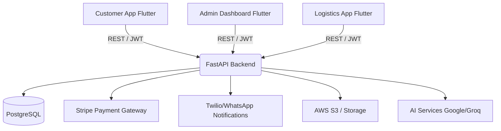

# Meat2Restaurant: Premium B2B Meat Delivery Platform
**Executive Overview & Technical Architecture**

## 1. Executive Summary

**Meat2Restaurant** is a state-of-the-art B2B wholesale platform designed specifically to streamline the supply chain between premium meat suppliers and restaurant businesses. The platform digitalizes the entire ordering, logistics, and inventory management lifecycle, offering an end-to-end ecosystem comprised of four highly integrated components: a robust backend API, a dynamic administrative dashboard, an intuitive customer-facing application, and a real-time logistics and delivery management app.

Built with scalability, security, and performance at its core, the project utilizes a modern technology stack—featuring a high-performance Python FastAPI backend, native-feel Flutter applications across all interfaces, real-time tracking, and AI-driven capabilities.

---

## 2. System Architecture Overview

The system operates on a microservice-inspired monolithic architecture, designed to handle high concurrency, secure transactions, and real-time updates.

---

## 3. Detailed Component Breakdown

### 3.1. Core Backend API (`meat_backend`)
The backend is the brain of the operation, built to handle complex B2B logic, dynamic pricing, and concurrent order processing.
- **Technology:** Python 3.13, FastAPI
- **Database:** PostgreSQL with SQLAlchemy ORM and Alembic for schema migrations.
- **Key Capabilities:**
  - **Secure Authentication:** JWT-based stateless authentication with strict RBAC (Role-Based Access Control).
  - **Payment Processing:** Deep integration with Stripe for handling B2B invoicing, recurring payments, and secure transactions.
  - **Automated Communication:** Twilio & WhatsApp integration for real-time order status updates and automated notifications.
  - **AI Integration:** Uses Google Generative AI and Groq for advanced data analytics, demand forecasting, and intelligent user interactions.
  - **Infrastructure:** Containerized via Docker, CI/CD ready, and AWS (Boto3) integrated for media and document storage.

### 3.2. Customer Application (`meat_customer`)
A premium, highly responsive interface tailored for restaurant owners and purchasing managers to place and track bulk orders effortlessly.
- **Technology:** Flutter, Riverpod (State Management), GoRouter
- **Design:** Modern UI with responsive builders, glossy headers, skeleton loaders, and micro-animations for a "top-notch" feel.
- **Key Capabilities:**
  - **Dynamic Catalog:** Real-time inventory syncing, advanced search, and dynamic product filtering.
  - **Seamless UX:** Fast navigation, cached network images for low bandwidth usage, and seamless checkout flows.
  - **Order Tracking:** Live order status updates directly from the backend.

### 3.3. Administrative Dashboard (`meat_admin`)
A comprehensive command center allowing platform operators to manage the entire B2B lifecycle.
- **Technology:** Flutter (optimized for Web and Tablet), Hive (Local Storage), FL Chart (Analytics).
- **Key Capabilities:**
  - **Data Visualization:** Real-time charting and reporting of sales, order volumes, and user activity.
  - **Catalog Management:** Full CMS capabilities to update products, pricing tiers, and promotional campaigns.
  - **User & Order Management:** Complete oversight of restaurant accounts, order approvals, and dispute resolution.

### 3.4. Logistics & Delivery App (`meat_logistic`)
A specialized application designed for delivery fleets to ensure timely and temperature-compliant delivery of meat products.
- **Technology:** Flutter, Google Maps & Flutter Map, LatLong2.
- **Key Capabilities:**
  - **Route Optimization:** Intelligent routing to ensure the fastest delivery times.
  - **Real-Time Tracking:** GPS integration for live vehicle tracking, providing ETAs to both the admin and the customer.
  - **Proof of Delivery:** Digital signatures, photo uploads, and automated manifest updates.

---

## 4. Key Advanced Features & Integrations

- **Enterprise-Grade Security:** Argon2 and Bcrypt hashing algorithms, JWT tokens, and strict CORS policies.
- **AI-Powered Insights:** Utilization of state-of-the-art LLMs (Groq, Google AI) to provide smart recommendations, automated customer support, and predictive inventory analytics.
- **Omnichannel Notifications:** Beyond standard emails, the platform utilizes WhatsApp Business API and Twilio to keep restaurant owners updated directly on their mobile devices.
- **Financial Infrastructure:** Fully automated billing, invoicing, and dynamic B2B pricing tiers powered by Stripe.

---

## 5. Scalability & Future Roadmap

The Meat2Restaurant platform is built not just for today, but for future expansion. 
- **Dockerized Deployments:** The backend is fully containerized, meaning it can instantly scale horizontally on AWS, GCP, or Azure using Kubernetes or Docker Swarm.
- **Cross-Platform Consistency:** By utilizing Flutter across all three client applications (Customer, Admin, Logistic), the codebase is highly maintainable, ensuring that new features can be rolled out across Web, iOS, and Android simultaneously.
- **Data-Driven Growth:** The robust PostgreSQL database structure paired with AI integrations lays the groundwork for future features such as automated dynamic pricing based on market meat rates and automated re-ordering for loyal customers.

---
*This document outlines the advanced technical capabilities and strategic architecture of the Meat2Restaurant platform, designed to disrupt and modernize the B2B wholesale meat supply chain.*
